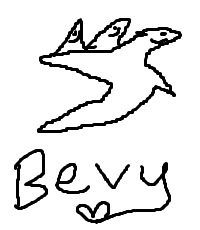

# Bavy-Showcase

Please visit Bavy's best friend, Bevy, here: <https://bevyengine.org/>!!!

## The Story of Bavy

When [Cart](https://github.com/cart) was creating Bevy, I suggested to him that he should make a Breakout game in the game engine to feel it out. I then mocked up this page as an initial showcase for Bevy.

## Technical Specs

I made Bevy using a mouse in like 45 seconds. I have a lot of trouble with mice firmware, so the :) faces didn't come across right. They're supposed to be billboarded at you, but instead it looks like the birds are looking sideways.

That's how it happens sometimes.

## License

CC0 - go nuts. I am the original author of this work and I release it in perpetuality for the success and enjoyment of Bevy and the Bevy community.

